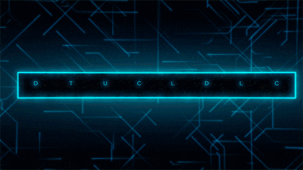

    

 
 

    
<h2>  About </h2>

    
 Full-Stack Developer | CyberSecurity Enthusiast  

    
    <ul>
        <li><a> Tech Stack: ⚙️ Django/Flask backends, ⚛️ React/Next.js frontends, 🎨 Tailwind/Bootstrap styling</a></li> 
        <li><a> Security Focus: Implement secure coding practices and conduct vulnerability assessments with a defender's mindset </a></li> 
        <li><a> DevSecOps Integration: Building workflows where security is seamlessly embedded, not added later </a></li> 
        <li><a> Goal: Tackle challenging projects requiring both technical excellence and security rigor </a></li> 
    </ul>
 

    

        <h2>
             
            Core Technologies & Frameworks 
        </h2>
    

    

        

 
        
        
        
        
        
        
        
        
        
        
        
        
        
        
    

    

        <h2>
             
            Other Languages and Tools 
        </h2>
    

    

        

 
        
        
        
        
        
        
        
        
        
        
        
        
        
        
         
        

    

<h2>  Profile Statistics </h2>

  

    
    
  

 

 

